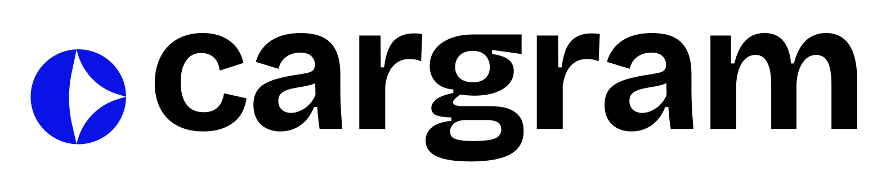

CarGram is a vibrant web platform for car enthusiasts to share their builds, modifications, and experiences. Our mission is to connect people passionate about cars, foster learning, and celebrate automotive creativity. Join CarGram to showcase your ride, get inspired, and make new friends!

## Features

- Share and browse car builds and modifications
- Participate in community threads and forums
- Responsive, modern UI with parallax and animation effects

## Tech Stack

- **Frontend:**   
- **Backend:**  
- **Routing:** 
- **Package Management:** 
- **State Management:** React Context API
- **Database:** 
- **Assets:** Custom images and logos

## Getting Started

1. Clone the repository: _**git clone https://github.com/otabek7/cargram.git**_
2. Install dependencies: _**cd cargram/client npm install**_
3. Start the development _**server: npm start**_

## Folder Structure

- `client/src/components/` – React components (Navbar, Footer, AboutUs, etc.)
- `client/src/assets/` – Images and static assets

---

© 2025 CarGram. All rights reserved.
